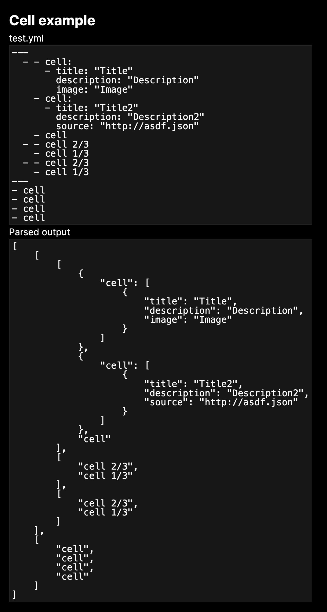

The examples above are taken from [YAML specification](https://yaml.org/spec/1.2.2/#22-structures) and loaded in a NextJS project with [yaml-loader](https://www.npmjs.com/package/yaml-loader)

As you can see, the loader can handle these structures well

## Getting Started

First, run the development server:

```bash
npm run dev
# or
yarn dev
# or
pnpm dev
# or
bun dev
```

Open [http://localhost:3000](http://localhost:3000) with your browser to see the result.